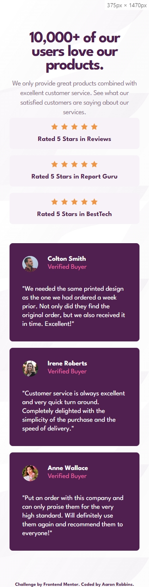
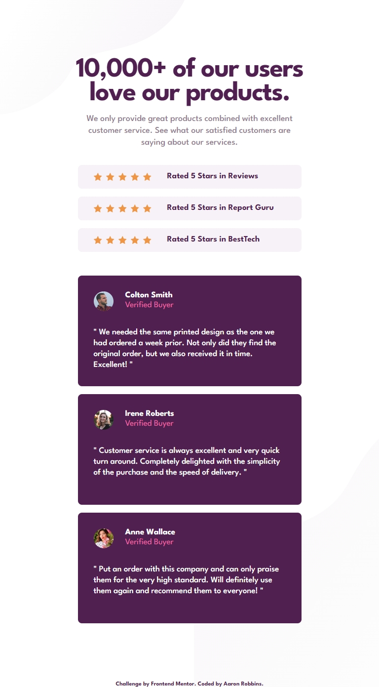
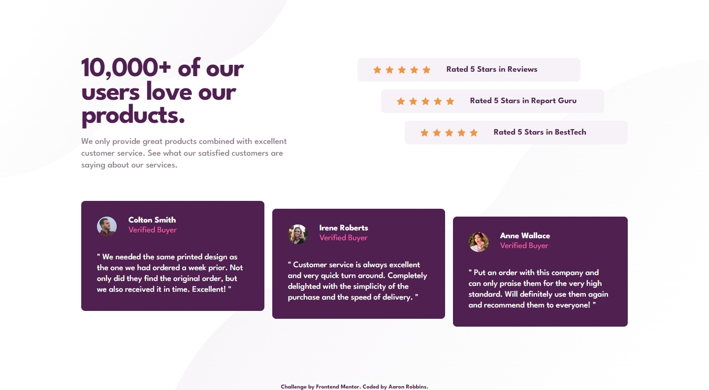
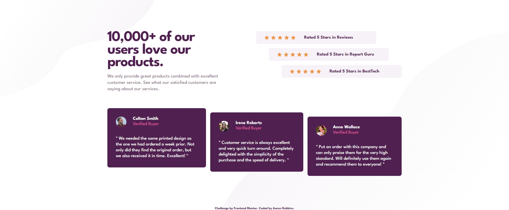

# Frontend Mentor - Social proof section solution

This is a solution to the [Social proof section challenge on Frontend Mentor](https://www.frontendmentor.io/challenges/social-proof-section-6e0qTv_bA). Frontend Mentor challenges help you improve your coding skills by building realistic projects.

## Table of contents

- [Overview](#overview)
  - [The challenge](#the-challenge)
  - [Screenshot](#screenshot)
  - [Links](#links)
- [My process](#my-process)
  - [Built with](#built-with)
  - [What I learned](#what-i-learned)
  - [Continued development](#continued-development)
  - [Useful resources](#useful-resources)
  - [AI Collaboration](#ai-collaboration)
- [Author](#author)
- [Acknowledgments](#acknowledgments)

## Overview

### The challenge

Users should be able to:

- View the optimal layout for the section depending on their device's screen size

### Screenshot






### Links

- [Solution URL](https://www.frontendmentor.io/solutions/responsive-landing-page-for-huddle-with-focus-states-lSwHBfZ1Qi)
- [Live Site URL](https://freexm1nd.github.io/social-proof-section-solution/)

## My process

### Built with

- Semantic HTML5 markup
- CSS custom properties
- Flexbox
- CSS Grid
- Mobile-first workflow
- CSS Nesting

### What I learned

This challenge humbled me. I did use Grid in the desktop layout and in the testimonial cards, but despite my confidence, the Grid layouts in this challenge were a little difficult for me. I used Flexbox everywhere else. Using margin-inline and margin-block was very helpful, but part way through this challenge I needed to reevaluate my design in a few places. I'm happy with the results, but this challenge took me a while. Eager to get back on track.

To see how you can add code snippets, see below:

```css
.testimonials {
  display: flex;
  flex-direction: column;
  gap: var(--spacing-16);
  & .testimonials__card {
    height: var(--testimonial-mobile-height);
    padding: var(--spacing-32);
    background-color: var(--purple-900);
    border-radius: var(--border-radius);
    color: white;
    font-size: var(--font-size-17);
  }
  & .testimonials__testimonial {
    line-height: var(--line-height-130);
    font-weight: var(--medium);
  }
  & .testimonials__user-info {
    display: grid;
    grid-template-areas:
      "pic name"
      "pic ver";
    grid-template-columns: 40px 1fr;
    grid-template-rows: 1fr 1fr;
    column-gap: var(--spacing-24);
    margin-bottom: var(--spacing-32);
    & .testimonials__avatar {
      grid-area: pic;
      height: var(--avatar-size);
      border-radius: var(--avatar-border-radius);
    }
    & .testimonials__name {
      grid-area: name;
      font-weight: var(--bold);
    }
    & .testimonials__verified {
      grid-area: ver;
      color: var(--pink);
    }
  }
}

.container {
  margin-inline: auto;
  display: grid;
  grid-template-areas:
    "header reviews"
    "testimonials testimonials";
  grid-template-columns: var(--container-desktop-grid-first-column) var(
      --container-desktop-grid-second-column
    );
  & .container__header {
    grid-area: header;
    margin-bottom: var(--spacing-60);
    & .container__head,
    .container__subhead {
      text-align: left;
      margin-inline: 0;
    }
  }
  & .container__reviews {
    grid-area: reviews;
    margin-inline-start: auto;
    & .container__review:first-of-type {
      margin-inline-end: var(--spacing-96);
    }
    & .container__review:last-of-type {
      margin-inline-start: var(--spacing-96);
    }
  }
}
```

If you want more help with writing markdown, we'd recommend checking out [The Markdown Guide](https://www.markdownguide.org/) to learn more.

**Note: Delete this note and the content within this section and replace with your own learnings.**

### Continued development

Grid seems to still be a little bit of a sticking point for me. I'm going to look up some challenges on Frontend Mentor that explicitly mention Grid and submit those challenges to polish my Grid skills.

### Useful resources

- [Example resource 1](https://www.example.com) - This helped me for XYZ reason. I really liked this pattern and will use it going forward.
- [Example resource 2](https://www.example.com) - This is an amazing article which helped me finally understand XYZ. I'd recommend it to anyone still learning this concept.

**Note: Delete this note and replace the list above with resources that helped you during the challenge. These could come in handy for anyone viewing your solution or for yourself when you look back on this project in the future.**

### AI Collaboration

I used Claude in this challenge to assist in brainstorming solutions and to assist in debugging.

## Author

- GitHub - [Aaron Robbins](https://github.com/FREExM1ND)
- Frontend Mentor - [@FREExM1ND](https://www.frontendmentor.io/profile/FREExM1ND)

## Acknowledgments

I'm thankful for the team at Responsively for creating a useful development tool.

Thank you to Frontend Mentor for the challenge. I'm eager to do more.
